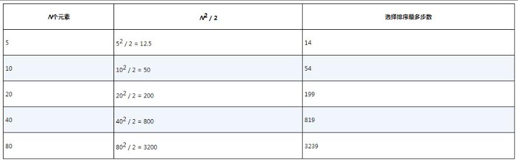
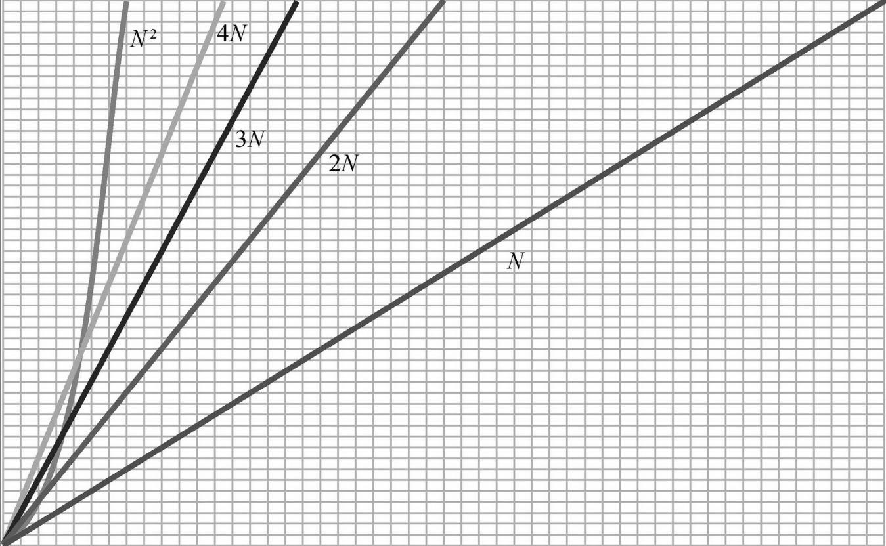

## 用大O记法来优化代码

#### 什么是大O记法？

_衡量算法效率的主要指标就是算法需要的步骤数。_

>不过，不能简单地说一个算法是“22步的算法”或者“400步的算法”。如果数组有800个元素，那么线性查找就需要800步，明明是解决同类型问题，但算法的步骤数随数据量变化而变化，这明显不是很合适。

 _量化线性查找效率更有效的方法，就是说它**查找数组中的N个元素需要N步**_。

 为了让时间复杂度的讨论更简单，计算机科学家从数学世界里借用了一个概念，这个概念就是大O记法。这种正式表述让我们可以轻松地把算法按照效率分门别类，并与人交流。

 _在最坏的情况下，数组中有多少元素，线性查找就需要多少步。正如先前所述：对于有N个元素的数组，线性查找最多需要N步，用大O记法来表示就是：O(N)，读作“ON”或者“N阶”。_

这个记法表述了一个**核心问题**的答案，这个核心问题就是：__如果有N个数据元素，那么算法需要需要多少步？__

* 特殊的两种时间复杂度

>**时间复杂度O(N)的算法也被称为 *线性时间算法*。    
>时间复杂度O(1)的算法被称作 *常数时间算法*。（无论N是多少，O(1)算法的步骤数都是固定的）**

---
#### 用大O给代码提速    

大O记法可以让你和**现有的一般算法**做比较，并思考这个算法到底是快呢还是慢？如果你发现直接的算法比较“慢”，那么可以回头看看能否优化得更快。虽然未必有优化的空间，但至少值得思考。   
下面我们会写一些解决实际问题的小算法(全文经典算法会汇总到[此处]( https://github.com/kirtozz/DataStructuresAndAlgorithms/blob/master/SummaryOfAlgorithms.md) )，再用大O来评估其复杂度，然后看看能否进行优化，提高算法效率。    
并会接着详细的介绍大O记法的其他原则和概念。本节的概念对于日后整个的优化思想都很重要，说是影响编程思维都不为过，还望初学者们仔细留意。

_已知一个无序数组，如何排序才能使其中的值按顺序排列？_   

接下来介绍几种排序算法。

- [冒泡排序](https://github.com/kirtozz/DataStructuresAndAlgorithms/blob/master/SummaryOfAlgorithms.md)    
  
所谓冒泡排序，我自己理解的就是多次遍历，两两比较，**“大数”沉淀下去，“小数”冒泡升起** 。这里的“大数小数”并不是固定的大或小，而是由代码里的判断判断条件决定升序降序。这里没看懂没关系，详见代码。下图用动图演示冒泡排序

     

_冒泡排序的效率_   

冒泡排序有两类重要的步骤   
- [ ] **比较**:比较两个数的大小。   
- [ ] **交换**:交换顺序错误的数。     
 
例子中的数组有**5个**元素  

>_**先分析比较**_       
>回顾第**一**次遍历，可以知道我们做了**4**次两两比较。   
>第**二**次遍历，只需要**3**次比较，因为在第一次遍历后，最后一个数的位置正确，所以无需比较最后两个数了。   
>第**三**次遍历需要**2**次比较，而第四次遍历只需要**1**次比较。    
>所以总计需要**4+3+2+1=10**次比较。        
**对于有N个元素，需要(N-1)+(N-2)+(N-3)+...+1次比较**     

>_**再分析交换**_        
>假设是最坏的情况，数组按降序排列（和我们的目标正相反），每次比较都需要交换。因此这种情况需要**10次比较和10次交换**，共计**20**步。            

因此对于总体情况，有5个元素倒序排列的数组，一共需要4+3+2+1=10次比较，10次比较又需要10次交换。总计20步。有10个元素倒序排列的数组，一共需要9+8+...+1=45次比较以及45次交换，总计90步。如果数组有20个值，那么需要190次比较，大约190次交换，共计380步。   

因此，冒泡排序的效率其实并不高，随着元素增加，步数呈**平方**增长。    

_因为冒泡排序处理N个值需要**N2** ，所以它的效率是**O(N2)** 。_    

O(N2)是一个效率相对低的算法，O(N2)也被称为**平方时间**。    

---

- [选择排序](https://github.com/kirtozz/DataStructuresAndAlgorithms/blob/master/SummaryOfAlgorithms.md)          

选择排序又被称为 **“打擂台算法”**，其大致过程是：遍历数组之前先创建一个变量**记录极值**（最小值或者最大值）的索引，并将**第一个索引**付给极值变量。在每次遍历中，需要把每个值和**当前**最小值（极值变量的索引处）进行比较，如有必要，需要把最小值**交换**到正确的位置。每次遍历结束后此时已经将第一个值排列完成。然后进入下一层遍历从上层遍历的**第二个值**开始重复以上。     

   

_选择排序的效率_    

同冒泡排序一样分析**比较**和**交换**次数，例子中的数组也有**5个**元素   

>_**先分析比较**_       
>回顾第**一**次遍历，可以知道我们做了**4**次两两比较。   
>第**二**次遍历，只需要**3**次比较，因为在第一次遍历后，第一个数的位置正确。   
>第**三**次遍历需要**2**次比较，而第四次遍历只需要**1**次比较。    
>所以总计需要**4+3+2+1=10**次比较。        
**对于有N个元素，需要(N-1)+(N-2)+(N-3)+...+1次比较**     

>_**至于交换**_        
>每次遍历**最多需要1**次，因为先遍历比较完所有的值之后**再执行交换**操作（此处是改良后的选择算法），交换的次数取决于最小值能否位于正确的位置，这个次数不是**0**就是**1**。而冒泡排序在数组完全倒序的情况下，**每次**比较都需要交换。        

所以对于总体情况，有5个元素倒序排列的数组，一共需要4+3+2+1=10次比较和4次交换。总计14步。有10个元素倒序排列的数组。一共需要9+8+7+...+1=45次比较以及9次交换，总计54步。以此类推...      

    
  
     

从上表可以看出，选择排序所需的步骤数大约是冒泡排序的一半，因此前者比后者快一倍。   
然而有趣的是，选择排序和冒泡排序的时间复杂度**完全相同**！    

记住，虽然大O记法的核心问题是：_对于N个数据元素，算法需要多少步？_     
似乎很合理的推测选择排序的效率是**O(N2/2)**。但是这里有个之前没有提到过的大O记法的一个重要原则：**大O记法忽略指数以外的常数**。   

怎么回事呢，这就引出了大O记法的下一个概念：大O记法只关注算法速度的**总体类别**。    

> 我们以楼房做比喻，楼房有很多种：一户人家的住宅可能有1层、2层或者3层。也有层数不同的高层公寓。还存在不同高度、不同形状的摩天大楼。假设要比较普通住宅和摩天大楼，那考虑层数就没什么意义了。因为二者的大小和功能差距过于悬殊，所以根本不用说：“这是一个2层住宅，而那是一栋100层的摩天大楼。”我们只会说一个是住宅，一个是摩天大楼。用类别已经足以区分二者。      

算法效率也是这样：O(N) 算法和O(N2)算法间的效率**差距过大**，以至于前者的效率究竟是O(2N)、O(N/2)还是O(100N)根本无所谓。   

     

上图可以清晰的看出，_尽管N有不同的系数，但O(N2)最终一定会更慢。_

不过，如果两个算法的类别相同，并不意味着它们的速度也相同。尽管同为O(N2),但冒泡排序比选择排序慢一倍，当两个算法复杂度属于同一类别时，需要进一步分析才能确定哪个算法更快。    

---    

- [插入排序](https://github.com/kirtozz/DataStructuresAndAlgorithms/blob/master/SummaryOfAlgorithms.md)      

插入排序没有冒泡排序和选择排序的那样简单粗暴，但却是一种**最直观**的排序算法。它的工作原理是通过**构建有序序列**，除却第一次遍历时是从**第二个**元素（也就是无序序列索引1处）取出一个元素作有序序列的**第一个值**，其余在每轮的遍历排序中，都从无序序列中取出**第一个**元素去和有序序列的每一个值比较，然后找到相应位置并插入，**使自己**成为有序序列。   

     

_插入排序的效率_    

插入排序有4类步骤：**比较**、**移位**、**取出**和**插入**         

>_**首先分析比较**_       
>第**一**次遍历构建有序序列时，我们创建了一个temp变量来存储取出的索引1处的值，它左边只有一个值，索引最多需要**1**次比较。   
>第**二**次遍历，则最多需要**2**次比较，以此类推，在最后一次遍历中，需要除了temp以外的所有值和它比较。换言之，如果数组有N个元素，则最后一次遍历最多需要**N-1**次比较。        
**所以需要1+2+3+...+(N-1)次比较，这大约是N2/2次。**   
  
>_**继续分析其他步骤**_        
>把一个值右移一个格子需要移位，如果数组是倒序排列，那么每一次比较都需要右移，所以移位次数和比较次数是相同的。     
>在最坏情况下，一共需要N2/2次比较+N2/2次移位=N2步。      
>每次遍历需要取出和插入temp各1次，因为总有N-1次遍历。所以是N-1次移除+N-1次插入=2N-2步。           

对于N个元素的序列来说，插入排序总计需要**O(N2)+2N-2**步，大O记法忽略常数，则乍看之下复杂度应该被简化成**O(N2+N)**。     

不过我现在要介绍另一个重要规则：如果有多个不同阶的项，那么大O记法只考虑**N的最高阶**。     

因此，在最坏的情况下，插入排序的时间复杂度和冒泡排序以及选择排序相同，都是**O(N2)**。   
介绍到这儿，你可能真的会认为**选择排序**是三者中的最优解，但事实没那么简单。    

---

#### 考虑了最坏情况也别忘了考虑平均情况    

注意，以上我们分析时间复杂度都是在考虑最坏的情况，但是有些实际问题是需要考虑在不同情况的，同时有些算法在不同情况下的时间复杂度有着比较明显的性能差异。  

排序问题就是个例子，所以想要详细研究插入排序的性能，我们还是得考虑平均情况。  
为什么？
根据定义，平均情况出现的频率最高。   

    

最好情况和最坏情况的发生频率相对较低。现实中出现最多的还是平均情况。  

以随机排列的数组为例，其中的值完全升序或者降序的概率又有多高呢？它们更可能被排列得乱七八糟，随机分布。
>  我们已经看过最坏的情况，也就是数组降序排列时的表现，在此情况下，插入排序每次都要比较、右移遇到的每一个值（共N2/次）    
>最好情况下，数组已经按升序排列完成，每一个值都位于正确的位置，所以每次遍历只需要1次比较，不需要任何移位。    
>假设数据是随机排列的，那么一次遍历可能需要比较、右移所有数据或部分数据，也有可能不需要移动任何数据。       
**因此，最坏的情况需要比较、右移所有数据；最好的情况无须移动任何数据（只需要每次遍历比较1次）；而在平均情况下，可以说整体上可能需要比较并移动大约一半的数据。故插入排序在平均情况下大约需要N2/2步（不过两者时间复杂度都是O(N2)）。**     

     

    

不难看出，插入排序的性能受具体情况**影响很大**。那么选择排序和插入排序谁更优秀呢？
>答案是：看情况。       
>如果数组随机排列，那么它们的表现就差不多。    
>如果你有合理理由相信要处理的数据大体上按顺序排列，那么插入排序就是更好的选择。   
>如果你有合理理由相信要处理的数据大体上按倒序排列，那么选择排序就是更好的选择。   
>如果你不确定，那么基本上就是平均情况，两者的表现都差不多。      

    
